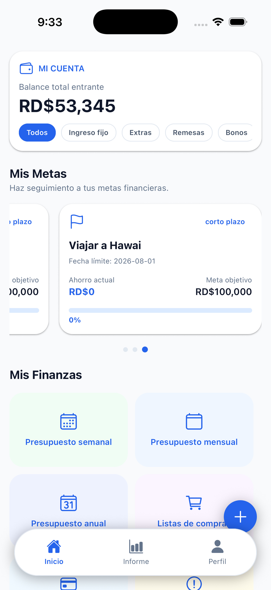

# TEFINANCE

**Tus finanzas personales, organizadas en un solo lugar.**

{ .phone-image }
{ .phone-image }

TEFINANCE es una aplicación de finanzas personales para iOS y Android que te ayuda a entender y controlar tu dinero, sin complicaciones.

---

## ¿Qué puedes hacer con TEFINANCE?

- 💰 **Registrar ingresos y gastos** de forma rápida y organizada.
- 📊 **Crear presupuestos** por categoría y darles seguimiento en tiempo real.
- 🎯 **Establecer metas de ahorro** y ver tu progreso.
- 💳 **Administrar tarjetas de crédito y préstamos** para mantener tus deudas bajo control.
- 📈 **Dar seguimiento a inversiones y fondos de emergencia**.
- 🛒 **Crear listas de compras** vinculadas a tu presupuesto.
- 🤖 **Generar informes financieros con inteligencia artificial** *(disponible en el plan Pro)* para obtener una visión clara de tu situación financiera.

---

## Planes disponibles

| | Free | Pro |
|---|---|---|
| Funciones básicas de gestión financiera | ✅ | ✅ |
| Presupuestos, metas y seguimiento de deudas | ✅ | ✅ |
| Informes financieros con IA | ❌ | ✅ |
| Experiencia sin publicidad | ❌ | ✅ |

---

## Privacidad ante todo

TEFINANCE **no vende tus datos** ni los usa para publicidad personalizada. No solicitamos acceso a tu cámara, ubicación, contactos ni fotos — solo lo necesario para ayudarte a gestionar tus finanzas.

📄 Consulta nuestra [Política de Privacidad](privacidad.md) y nuestros [Términos y Condiciones](terminos.md) para más detalles.

---

## Descárgala

*(Próximamente disponible en App Store y Google Play)*

---

¿Tienes preguntas? Escríbenos a **amplexus.sagitta@gmail.com**