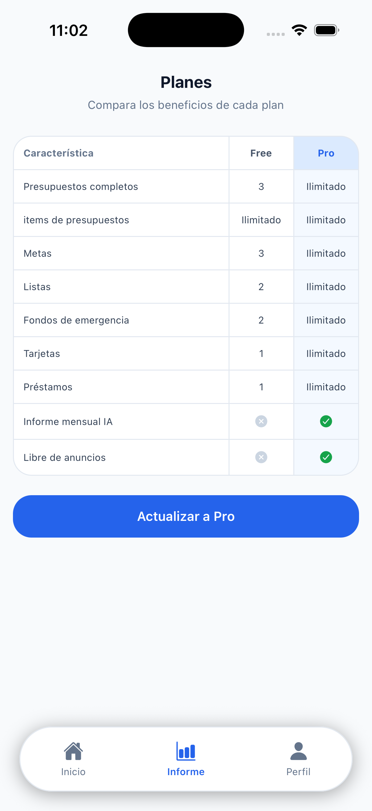

# Finanzas personales · iOS & Android

Registra, presupuesta y da seguimiento a tu dinero desde un solo lugar — sin hojas de cálculo, sin complicaciones.

{ .phone-image style="width:150px" }
{ .phone-image style="width:150px" }

TEFINANCE es una aplicación de finanzas personales para iOS y Android, desarrollada por **MBL Development** (entidad responsable ubicada en Estados Unidos, operada por una persona física), que te ayuda a entender y controlar tu dinero, sin complicaciones.

Funciones

¿Qué puedes hacer con TEFINANCE?

💰
### Ingresos y gastos
Registra tus movimientos, clasifícalos por categoría y consulta tu historial completo en cualquier momento.

📊
### Presupuestos
Define límites de gasto por categoría y sigue en tiempo real cuánto llevas gastado frente a lo planeado.

🎯
### Metas de ahorro
Crea objetivos con monto y plazo, y visualiza tu progreso hacia cada meta.

💳
### Tarjetas y préstamos
Registra tus deudas, fechas de pago y montos pendientes para mantenerlas bajo control.

📈
### Inversiones y fondo de emergencia
Da seguimiento al valor de tus inversiones y al avance de tu fondo de emergencia.

🛒
### Listas de compras
Planifica compras y ve cómo impactan el presupuesto de la categoría correspondiente.

Pro
### Informes con IA
A partir de tus propios datos financieros, un proveedor de IA configurable genera un resumen y recomendaciones sobre tu situación.

Planes

Planes disponibles

| | Free | Pro |
|---|---|---|
| Funciones básicas de gestión financiera | ✔ | ✔ |
| Presupuestos, metas y seguimiento de deudas | ✔ | ✔ |
| Informes financieros con IA | — | ✔ |
| Experiencia sin publicidad | — | ✔ |

Las suscripciones al plan Pro se gestionan a través de RevenueCat y de las tiendas de aplicaciones (App Store / Google Play).

Privacidad

Qué datos pedimos y por qué

TEFINANCE solo solicita la información necesaria para ofrecer sus funciones. No pedimos acceso a tu cámara, ubicación, contactos ni fotos, porque ninguna función de la app los necesita.

- **Cuenta y autenticación** (Supabase, e inicio de sesión con Google o Apple): para crear tu cuenta, identificarte de forma segura y sincronizar tus datos entre dispositivos.
- **Datos financieros que tú registras** (ingresos, gastos, presupuestos, metas, deudas, inversiones): para mostrarte tus reportes y seguimiento dentro de la app. En el plan Pro, estos mismos datos se envían a un proveedor de IA configurable (Google Gemini, OpenAI, Groq según disponibilidad) únicamente para generar tus informes financieros bajo pedido.
- **Información de suscripción** (RevenueCat): para validar y administrar tu plan Free o Pro.
- **Identificador de publicidad** (Google AdMob, solo en el plan Free): para mostrar anuncios dentro de la app. El plan Pro elimina la publicidad.

TEFINANCE no vende tus datos ni los usa para publicidad personalizada fuera de la app.

📄 Consulta nuestra [Política de Privacidad](privacidad.md) y nuestros [Términos y Condiciones](terminos.md) para más detalles.

¿Descarga? Próximamente en App Store y Google Play. 
¿Preguntas? Escríbenos a <a href="mailto:amplexus.sagitta@gmail.com">amplexus.sagitta@gmail.com</a>

